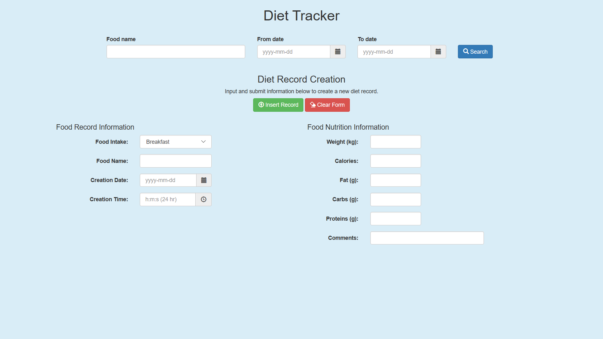
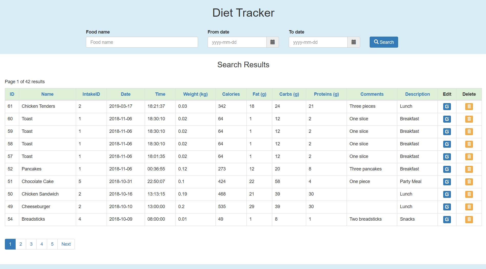
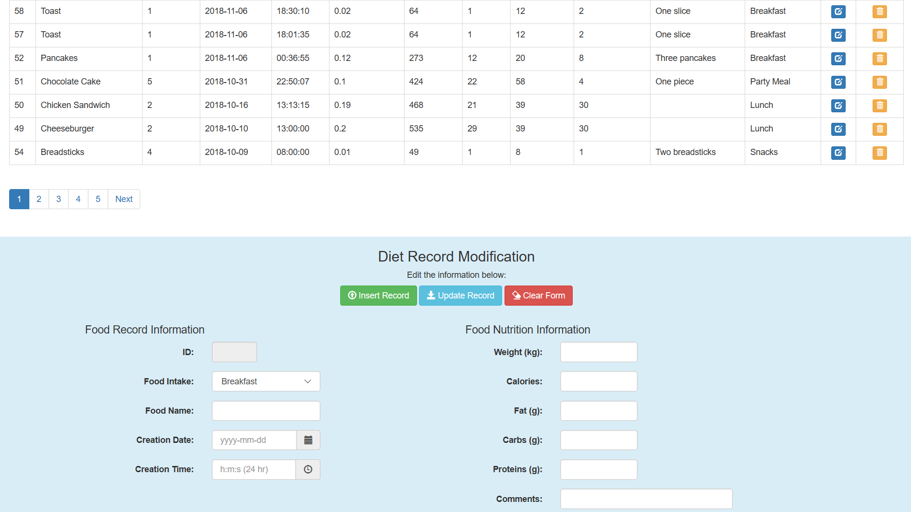

# Diet Tracker Website

In this project, a PostgreSQL database access website was developed to access and edit the diet tracker PostgreSQL database. 
The website was originally designed to access a MySQL database, so the code needed to be modified to use the PostgreSQL database. 
Heroku's Apache2 server is used to run the diet tracker website.

## Development Tools, Utilities, and Languages
* PostgreSQL11
* pgAdmin4
* Apache2
* Composer
* PHP

## Development Process
* Dump the MySQL diet tracker database and convert the MySQL code to PostgreSQL
* Import the diet tracker database to a local PostgreSQL11 database for testing purposes
* Convert the MySQL code to PostgreSQL in the PHP files
* Debug the website using the built-in PHP server
* Access Heroku's PostgreSQL database using pgAdmin4
* Dump the PostgreSQL diet tracker database and import to Heroku's PostgreSQL database
* Set up Heroku's dependencies (composer.json, Procfile) and deploy the diet tracker website to Heroku

## Credits
The website uses Bootstrap 3.4.1, jQuery 3.31, bootstrap-datepicker, and bootstrap-timepicker.
* [Bootstrap 3.4.1](https://getbootstrap.com/docs/3.4/)
* [jQuery 3.31](https://code.jquery.com/)
* [bootstrap-datepicker](https://cdnjs.com/libraries/bootstrap-datepicker)
* [bootstrap-timepicker](https://cdnjs.com/libraries/bootstrap-timepicker)

## Diet Tracker Website
https://diet-tracker-database.herokuapp.com/

### Diet Tracker Main Webpage

### Diet Tracker Search Results Webpage

